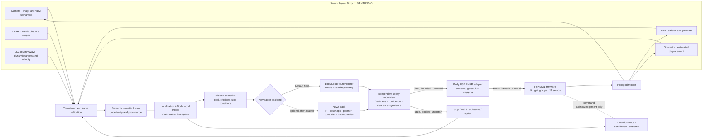

# Body Autonomy and FNK0031 Workflow

## Ownership boundary

- Body on the VENTUNO Q owns sensor ingestion, timestamps, coordinate frames,
  perception/fusion, world state, mission decisions, route planning and safety
  supervision.
- The FNK0031 board remains the gait/motor controller. Its FNHR firmware owns
  inverse kinematics, gait execution and the 18 servo outputs.
- The Body-to-FNK link is USB serial using the FNHR framed protocol. The Body
  sends semantic robot actions; it does not command individual motors.
- Nav2 is optional. It is a navigation backend, not a replacement for the
  FNK0031 firmware or its USB command adapter. A Nav2 deployment needs a base
  adapter that translates its velocity/control output to calibrated FNHR
  actions and reports odometry back into ROS.

## End-to-end autonomy loop

The camera/VLM contributes semantic hypotheses; it is not the sole motion
sensor and its output does not certify clearance. LiDAR/ToF provide range,
mmWave helps track moving targets, and IMU/odometry estimate motion between
observations. GPS is useful outdoors for global position, not indoor obstacle
avoidance. The safety gate must fail closed when required measurements are
stale, inconsistent, out of frame, or below confidence thresholds.

## FNHR action boundary

The current USB transport supports the stock protocol's semantic action set:

- Modes: `ActiveMode`, `SleepMode`, `SwitchMode`.
- Gaits: `CrawlForward`, `CrawlBackward`, `CrawlLeft`, `CrawlRight`,
  `TurnLeft`, `TurnRight`.
- Parameterized: `Crawl(x, y, angle)`, `ChangeBodyHeight(height)`,
  `MoveBody(x, y, z)`, `RotateBody(x, y, z)`,
  `TwistBody(xMove, yMove, zMove, xRotate, yRotate, zRotate)`, and
  `LegMoveToRelatively(leg, x, y, z)`.

`SetActionSpeed` and `SetActionGroup` are not exposed by the stock FNHR serial
protocol implemented by the current adapter. `SleepMode` is not an emergency
stop. The existing protocol acknowledges action start/completion but does not
provide robot pose or odometry. Command units, gait duration, stopping distance
and behavior under a lost USB connection need bench calibration before any
closed-loop physical autonomy is enabled.

## Workflow Builder simulation

`Load autonomy scenario` creates an executable, saved-on-Body workflow:

1. Synthesize synchronized camera, LiDAR, mmWave, IMU and odometry observations.
2. Validate sensor timestamp skew and derive a pose from odometry + IMU.
3. Associate visual semantics with LiDAR geometry and mmWave dynamic tracks.
4. Plan a metric route around static and moving obstacles.
5. Apply freshness, confidence and route-existence checks; refuse stale or
   blocked scenarios.
6. Exercise `NavigateToPose` only through the isolated
   `/pandorabox/mock_navigate_to_pose` ROS action endpoint when ROS 2 is
   available; otherwise use the deterministic Body mock fallback. The real
   `/navigate_to_pose` server is never called by this template.
7. Produce symbolic `Crawl(x, y, angle)` intents for the FNK adapter and record
   a mission report. Simulation map deltas are not calibrated FNHR units; the
   USB port is not opened and no servo moves.

This validates workflow data contracts, failure gates and the ROS action
boundary. It does not validate a real Nav2 costmap/controller, sensor
calibration, FNK gait response, displacement, or autonomous safety. The
VENTUNO has the Nav2 software packages, but a robot-configured Nav2 stack and a
FNK-compatible `cmd_vel` adapter are separate runtime components and must be
verified before selecting Nav2 for real motion.

## Physical rollout gates

1. Confirm the exact FNK USB port and read-only echo/voltage diagnostics.
2. Validate individual semantic commands with the chassis mechanically safe,
   operator present, and conservative timeouts.
3. Calibrate command units and measure action duration, actual displacement,
   heading change, stop latency and USB-loss behavior.
4. Integrate IMU and odometry feedback and verify coordinate frames/time sync.
5. Test obstacle stop/replan with recorded sensor data, then controlled live
   sensors. Keep physical actuation disabled by default.
6. Only then compare Body LocalRoutePlanner with a Nav2 backend. Nav2 is an
   option, not a prerequisite for Body autonomy.
