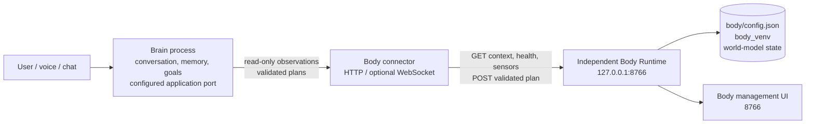
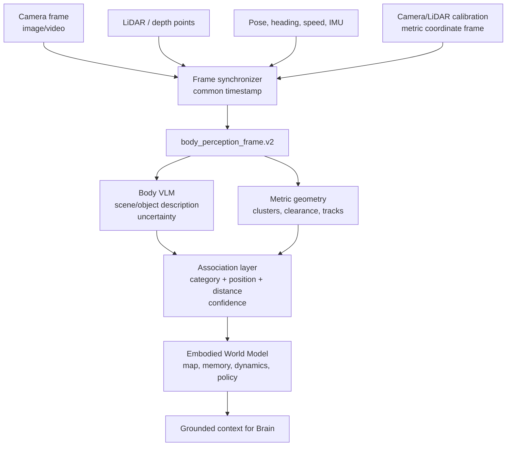
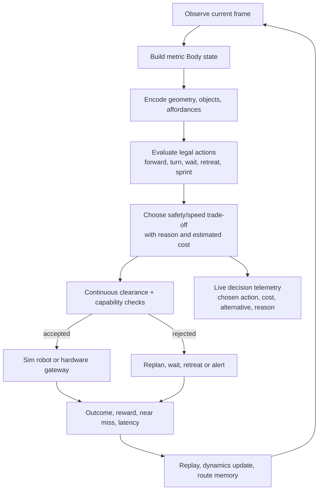
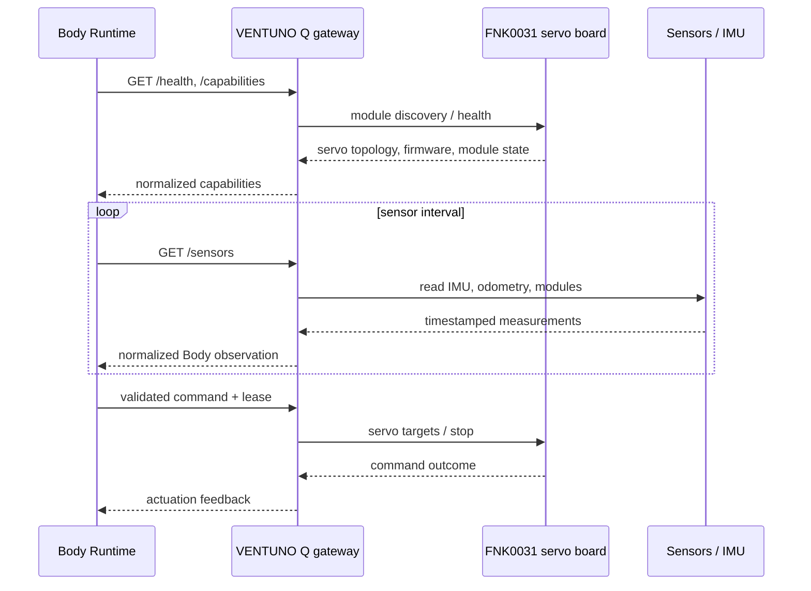
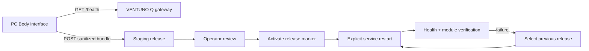

# PandoraBOX Body Schematics

This document describes the implemented Body boundary and the intended data
flow. It is a protocol and ownership map, not a claim that physical FNK0031
hardware is already connected.

## 1. Process separation

Ownership rules:

- the Body owns plugins, credentials, physical memory, geometry and actuation;
- the Brain can consume Body context but cannot rewrite Body state directly;
- the Body may run with no Brain connected;
- a physical command must be validated, auditable and confirmation-gated.

## 2. Perception fusion

The VLM is advisory. It may name an object or describe a surface, but it does
not override metric geometry, collision checks, pose, speed or action legality.
Unknown or low-confidence entities are retained as uncertain evidence or
rejected from the actionable scene rather than silently becoming facts.

## 3. World-model control loop

The same loop supports a simulated robot and a physical gateway. Simulation is
used for bounded evaluation and learning; it is not hardware validation.

## 4. FNK0031 transport

The FNK0031 owns servo timing and the local hard stop. VENTUNO Q provides
networking, Linux services and optional camera/LiDAR/VLM processing. Loss of
the Body or gateway connection must leave the actuator path stopped.

## 5. Deployment flow

Bundles exclude virtual environments, Git metadata, caches and secret values.
The target device supplies its own tokens and local environment configuration.

## 6. Evidence gates

| Gate | Evidence required | Current meaning |
|---|---|---|
| Simulation | repeated shuffled scenes, zero collisions, useful route metrics | Provisional policy evidence |
| Perception | VLM grounding precision, invented-object rate, vision/LiDAR association stability | Required before trusting semantic scene context |
| Restart/resume | persisted plan lease and next-step continuity | Software validation |
| Gateway | module health, normalized sensors, hard-stop response | Integration validation |
| Hardware | calibrated servos, IMU/odometry, slow-speed trials and physical safety | Not established by simulation |

