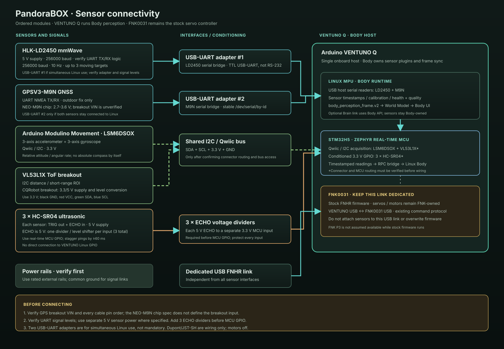

# Body sensor bring-up: VENTUNO Q + FNK0031

## Hardware in the delivery

| Module | First connection target | Body role | Important constraint |
| --- | --- | --- | --- |
| HLK-LD2450 | VENTUNO Q Linux via USB-UART, or MCU UART with a data-forwarding sketch | Up to 3 moving metric targets | 5 V supply (>200 mA), 256000 baud, 10 Hz; official manual states PA9 is 3.3 V but does not specify UART TX/RX logic in text; verify those pins |
| Arduino Modulino Movement (LSM6DSOX) | VENTUNO Q Qwiic / MCU I2C | 3-axis acceleration and gyro | Qwiic is 3.3 V; Qwiic pin order is GND, 3V3, SDA, SCL |
| GPSV3-M9N | VENTUNO Q Linux via USB-UART, or MCU UART with a data-forwarding sketch | Outdoor GNSS/map anchor | NEO-M9N chip is 2.7-3.6 V; exact GPSV3 breakout regulator and I/O level are unverified, so identify its VIN label before power |
| CQRobot VL53L1X (B07F3TV3G4 / CQRWX00744US) | VENTUNO Q Qwiic / MCU I2C | Short-range ToF distance/ROI | CQRobot manual specifies 3.3/5 V supply and level conversion; use 3.3 V on VENTUNO and verify cable colors/pin labels |
| 3 x HC-SR04 | VENTUNO Q real-time MCU GPIO, not Linux GPIO | Narrow-beam short-range range checks | 5 V supply; add one divider/level shifter per ECHO before each 3.3 V GPIO |
| Dupont and JST-SH leads | Wiring only | Prototyping | Connector fit does not guarantee matching pin order; verify every cable end-to-end |

The VENTUNO Q owns perception and sensor acquisition. The FNK0031 remains
stock FNHR firmware and the motor/servo controller. Keep its existing USB link
reserved for the FNK protocol. Do not attach new UART devices to that serial
link, overwrite its firmware, or assume that the FNK P3 port is available while
stock firmware is running.

## Physical topology



For the pin-by-pin cable plan, including the HC-SR04 ECHO dividers, see
[BODY_SENSOR_WIRING.svg](BODY_SENSOR_WIRING.svg).

The first image is the architecture overview; the detailed wiring sheet gives
pin-to-pin routes for the documented interfaces. The GPS breakout input and
LD2450 UART levels remain explicitly unverified. Confirm board labels, signal
voltage, power source and connector pin order before plugging anything in.

```text
HLK-LD2450 -- UART / USB-UART ----┐
GPSV3-M9N -- UART / USB-UART -----┤
Modulino Movement -- Qwiic/I2C ---┤--> VENTUNO Q Body Runtime
VL53L1X -- I2C (after breakout ---┤       -> body_perception_frame.v2
                  voltage check)  │       -> Body UI / world model / Brain API
HC-SR04 x3 -- conditioned GPIO ---┘
FNK0031 stock controller <------ dedicated USB FNHR command link
```

For initial UART tests, one USB-UART adapter can be moved between sensors;
two adapters are only needed to leave both connected to Linux simultaneously.
Use TTL USB-UART adapters (not RS-232). A 3.3 V adapter is the conservative
choice, but verify the sensor TX/RX logic and adapter pinout before connecting;
cross TX/RX and connect GND.
Keep sensor power separate from the adapter's VCC pin unless that exact board's
power input is confirmed. On Linux, configure stable `/dev/serial/by-id/...`
paths, not transient `/dev/ttyUSB0` numbering. The VENTUNO Q has two USB-A
ports, so using FNK USB, two adapters, and a USB camera together requires a hub
or a different acquisition route. Sensor grounds and VENTUNO ground must be
common for wired UART/GPIO signals.

For the CQRobot VL53L1X breakout (B07F3TV3G4), its published manual gives the
wire colors as black=GND, red=VCC, green=SDA, blue=SCL, yellow=SHUT, orange=INT
and claims 3.3/5 V level conversion. Prefer 3.3 V VCC on the VENTUNO Q. Its
I2C address is 0x29; Modulino Movement defaults to 0x6A, so they do not collide
on the same Qwiic bus. Still verify the actual delivered cable and board labels.

The GPSV3-M9N product listing identifies the receiver family but does not
provide a trustworthy schematic for the seller's breakout. The u-blox NEO-M9N
chip itself is 2.7-3.6 V and its I/O levels track VCC. Do not infer that the
breakout accepts 5 V from the chip specification: check the PCB's VIN marking
or seller schematic first, and use 3.3 V UART logic regardless.

The LD2450 reports X lateral, Y forward in millimetres, and signed velocity in
centimetres/second. Body converts these to metres and metres/second in a
sensor-local frame, then applies a measured mounting transform before fusion.
The M9N fix is geographic, not local-map odometry: only use it outdoors and
anchor/project it with its reported accuracy. The Modulino Movement gives
acceleration and angular rate; it does not provide absolute heading by itself.

## Software readiness and staged validation

`body_requirements.txt` already includes `pyserial`. The Body currently has a
vendor-neutral mmWave JSON-over-HTTP adapter and accepts IMU/GNSS fields from
the robot gateway. Direct LD2450 UART and direct NMEA ingestion still need to
be connected to runtime configuration and the live perception frame. The
serial decoders in `body_runtime_host/sensor_serial.py` are parser groundwork,
not a claim that a physical module has already been acquired or tested.

1. Record exact breakout labels, cable pin order, device IDs and idle voltages.
2. Bring up the M9N outdoors alone; verify checksum-valid GGA/RMC, fix quality,
   satellites, HDOP and stale-data behavior.
3. Bring up LD2450 alone; validate signed X/Y and velocity using a person
   crossing left/right and approaching/receding at measured positions.
4. Connect Modulino Movement on Qwiic and verify raw axes, units, orientation
   and timestamping with stationary and hand-rotated tests.
5. Connect one VL53L1X and one HC-SR04 through verified voltage conditioning;
   confirm the MCU acquisition route and compare readings against a ruler.
6. Add the remaining two HC-SR04 sensors one at a time. Stagger pings by at
   least 60 ms per sensor to limit acoustic crosstalk.
7. Enable fusion only after each modality reports source, timestamp, frame,
   calibration, quality and stale/error state in the Body UI.
8. Run stationary sensor-only tests, then hand-carried tests with motors
   disabled. Physical actuation remains confirmation-gated until calibration
   and stopping behavior have been measured.

## Acceptance gates

- FNK USB controller remains discoverable and retains its stock remote behavior.
- No 5 V signal reaches a 3.3 V-only pin; no sensor is powered from an
  unverified rail.
- Every sensor has an independently visible online/offline/stale/error state.
- LD2450 positions and relative velocity use a documented robot-frame
  transform; the transform is calibrated rather than guessed from cable or
  board orientation.
- GNSS reports fix quality and uncertainty; no-fix coordinates are never
  treated as a valid robot pose.
- IMU angular velocity is integrated only with drift/uncertainty represented;
  it is not presented as absolute planar heading.
- Simulation and physical sensor frames are visibly distinguished in UI and
  logs.
