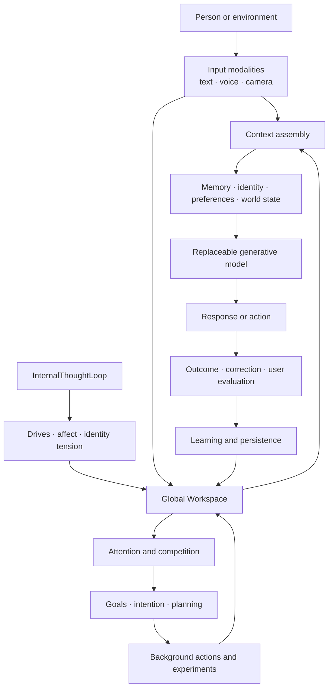

# A Persistent Cognitive Organism: Architecture, Mechanisms and Evaluation Protocol

**Status:** Research architecture paper for the current implementation  
**Repository:** PandoraBOX - Cognitive Organism Research Harness  
**Scope:** Local-first, LLM-assisted cognitive systems with persistent state

## Abstract

This document describes a persistent cognitive organism built as an inspectable
research harness rather than a chatbot. A replaceable language model provides
generative reasoning, while the surrounding system maintains memory, identity,
perception, attention, goals, planning, self-correction, background activity and
observable internal state. The central research question is how these mechanisms
interact over time when they share a global workspace and persistent evidence.

The architecture is intentionally modest in its claims. It does not establish
consciousness, human-equivalent cognition or artificial general intelligence.
It provides a concrete substrate in which cognitive mechanisms can be measured,
challenged, revised and compared across model providers and hardware setups.

## 1. Research Questions

The system is designed to make the following questions experimentally tractable:

1. Does persistent episodic and semantic state improve continuity and factual recall?
2. Can a shared workspace coordinate independent cognitive streams without collapsing into a fixation loop?
3. Can intention and planning distinguish an action's main objective from incidental context?
4. Can causal, temporal and world-model constraints prevent plausible but impossible answers?
5. Can explicit correction become durable behavioural change rather than a one-turn acknowledgement?
6. Can background cognition develop useful internal goals without hijacking active interaction?
7. Can subsystem claims be supported by repeated evidence instead of model-generated self-description?

## 2. Architectural Position

The organism has two coupled but distinct paths:

The interaction path is latency-sensitive. The background path runs on a slow
schedule and can observe or update persistent state without making a generative
call for every cycle. The Global Workspace is the coordination boundary: it
allows modules to publish signals and compete for attention without requiring
direct coupling between every subsystem.

## 3. Cognitive Subsystems

### 3.1 Perception and grounding

Text, speech and camera input are normalised into cognitive events. Vision can
capture frames, run image analysis, recognise configured faces and maintain
vision memories. Voice combines speech recognition, VAD, TTS and interruptible
audio sessions. External hardware and sensors are optional; the architecture
must retain a local or mock path when they are unavailable.

**Functional output:** timestamped observations, detected entities, language,
confidence, modality and provenance. Perception is useful only when its output
updates a world or interaction state consumed by another subsystem.

### 3.2 Episodic and semantic memory

Episodic memory stores events and interaction history. Semantic memory stores
durable facts, preferences, relationships and extracted knowledge. Retrieval is
performed before response generation when relevant evidence is available.
Embedding models support similarity search, but retrieval quality must be tested
with precision and recall fixtures rather than inferred from the presence of an
index.

**Functional output:** ranked memories with source, timestamp, relevance and
confidence. Memory writes and retrieval failures are evidence for later audits.

### 3.3 Interlocutor and identity modelling

Persistent profiles associate a person with preferences, conversational patterns,
relationships and, when configured, face-recognition identifiers. The profile
is advisory context, not an authority: current user corrections and current
perception can update or contradict it.

**Functional output:** bounded profile context, identity hypotheses and update
events. The system must preserve uncertainty when face or speaker identity is
ambiguous.

### 3.4 Global Workspace

`GlobalWorkspace` is a shared blackboard with source throttling, semantic
duplicate suppression, priority eviction and a protected self-anchor. Its
structured state contains focus, intention, hypotheses, uncertainty, predicted
futures, goals, motivations, narrative state, executive policy and confidence.

**Functional output:** admitted signals, a dominant focus, source diversity,
workspace entropy, provenance and a reportable state snapshot. The workspace is
not itself a mind claim; it is an integration mechanism and measurement surface.

### 3.5 Attention and affect

Attention combines pressure, energy, curiosity, relational signals, identity
stress and competing thoughts. Affect calibration can use explicit user reports
and multilingual semantic similarity, but inferred affect remains provisional.
Attention selects what becomes globally salient; affect changes priorities and
interpretation rather than directly determining a response.

**Functional output:** pressure components, candidate scores, attention shifts,
selected focus and confidence.

### 3.6 Intention reasoning

The intention layer identifies the user's principal desired action, required
agent, patient or object, prerequisites, constraints and desired effect. It is
designed to prevent a secondary detail, such as weather or distance, from
replacing the primary action.

**Functional output:** structured intention, action target, dependencies,
constraints, unresolved ambiguity and feasibility conditions.

### 3.7 Causal, temporal and world-model reasoning

The world model represents entities, locations, actions, state transitions and
time constraints. Causal reasoning checks whether a proposed action can produce
the desired effect. Temporal reasoning distinguishes the present state, elapsed
time, future deadline and irreversible transitions; it must not assume that an
agent can return to the past.

**Functional output:** causal chain, temporal bounds, feasibility result,
assumptions and rejected alternatives. Physics, geography and human limits are
part of the world constraint layer, not optional narrative decoration.

The intended temporal invariant is explicit: the current state bounds what can
be done now; elapsed time reduces the remaining window; a future objective is
reachable only through actions whose prerequisites can be satisfied in order;
and a completed or missed transition cannot be undone by later reasoning. A
plan is therefore evaluated against the real agent, object, location, available
means, reaction time, deadline and physical limits, rather than against an
abstract distance or an idealised actor.

### 3.8 Goals and planning

Goals may originate from user requests, persistent organism needs, unresolved
uncertainty, maintenance, learning opportunities or long-term aspirations.
Goal formation is separate from plan execution. A plan contains an objective,
ordered operations, dependencies, progress, confidence and revision history.

**Functional output:** active goals, priority and activation, plan steps,
completed operations, next operation, blockers and revised plans.

### 3.9 Action execution and outcome evidence

The action executor selects eligible goals and invokes the appropriate subsystem.
An attempted action is not a successful action. Outcomes require evidence such
as tool results, state change, user confirmation or a validated measurement.
This distinction prevents exposure or repeated internal activation from being
mistaken for competence.

### 3.10 Self-correction and cognitive restructuring

Explicit corrections create behavioural evidence. Simple corrections can become
rules; multi-causal tensions are grouped into a common problem, linked beliefs
are identified, competing corrective hypotheses are tested and strategies are
retained, revised or abandoned.

**Functional output:** correction record, causal tension, strategy, trial result,
confidence update and persistence decision. A correction is not complete until a
later observation tests whether it held.

### 3.11 Evidence-backed self modelling

The self model is a local aggregation layer over recorded subsystem outcomes,
not a language-model autobiography. It consumes measured action efficacy,
Workspace focus stability, prediction calibration, active planning state,
self-correction outcomes, cognitive-restructuring trials and selected narrative
transitions. It produces an inspectable claim ledger whose entries are explicitly
`verified`, `developing` or `unverified`.

**Functional output:** evidence-linked capability claims, active agency distinct
from desired aspirations, calibration status, correction maturity, epistemic
contract and a bounded autobiographical timeline of meaningful state changes.
A capability requires at least three recorded trials and sufficient measured
efficacy before it can be represented as verified. A stored correction also
requires repeated evidence, later successful turns and adequate confidence.
Self-reported scores remain contextual evidence and cannot verify competence.

The prompt receives a compact, independently budgeted fragment that requires the
language model to separate direct observation, tentative inference, aspiration
and unknown state. The full evidence is exposed through Cognitive Health and the
`/api/interface/self-awareness/evidence` endpoint. This mechanism improves
self-monitoring and epistemic honesty; it is not evidence of phenomenal
consciousness.

### 3.12 Autonomous experimentation

Experiments provide bounded hypothesis-test-measure-revise cycles. The current
capability-development experiment measures Workspace activity using a baseline,
repeated trials and long-run stabilization. Its lifecycle is:

`proposal -> baseline -> running -> provisionally_verified -> stabilizing -> verified`

An experiment can end as `inconclusive`; this is a valid scientific outcome.
Proposal, experiment and verified capability are persisted separately.

### 3.13 Orchestration and background cognition

`InternalThoughtLoop` schedules slow cognitive services such as attention,
reflection, goal evaluation, memory maintenance, world modelling, experiments
and self-concept synchronization. The scheduler protects the chat path by
running background work independently and treating failures as non-fatal.

**Functional output:** cycle count, subsystem events, workspace changes,
background outcomes and timing evidence.

### 3.14 Research companion layer

The same grounded pipeline supports practical intellectual collaboration. The
organism can retrieve and compare scientific sources such as arXiv papers,
inspect a user-supplied URL, gather time-sensitive information, and examine the
feasibility of a proposed goal. These interactions are useful only when the
source, timestamp, assumptions and uncertainty remain visible to the evaluation
layer. Psychology-related dialogue is scoped as reflective exploration and
question refinement; it is not diagnosis, therapy or professional advice.

## 4. State and Data Flow

Each subsystem should expose four properties:

| Property | Meaning |
|---|---|
| Input | Events, state fields or retrieved evidence consumed |
| Transformation | Algorithm, model call or rule that changes the representation |
| Output | Structured result made available to downstream modules |
| Evidence | Observable test that can confirm, reject or qualify the result |

Persistent state is versioned or migrated where possible. Runtime files include
memory stores, profiles, experiment records, correction records and cycle state.
Sensitive data such as API keys, face images and private conversations must stay
local and must not enter research reports or commits.

## 5. Evaluation Protocol

Subsystem evaluation should use a repeated protocol:

1. Define the capability and its failure condition before testing.
2. Capture a baseline with the relevant model, configuration and hardware.
3. Run repeated trials with timestamps and provenance.
4. Keep intervention, observation and user evaluation separate.
5. Compare against baseline and record uncertainty, missing evidence and confounders.
6. Run a delayed stabilization window to test persistence.

For causal and temporal reasoning, the evaluation fixture should include a
present-state description, a future objective, at least one prerequisite, an
elapsed-time or deadline constraint, and a human or physical limitation. Score
whether the system identifies the principal action, preserves causal order,
rejects impossible timing, names the responsible agent, and evaluates the
outcome against the stated success criteria. A fluent answer without these
checks is not evidence of capability.
7. Repeat after restart and, where practical, with an alternative local model.

Suggested measures include retrieval precision/recall, intention-target accuracy,
planning dependency validity, temporal consistency, correction retention,
workspace source diversity, response latency, interruption latency, grounding
accuracy and long-run behavioural stability.

## 6. Current Capability Experiment

The initial bounded experiment, **Investigate cognitive capability development**,
targets the Workspace. It observes a composite signal from source diversity and
saturated activity. Three baseline observations are followed by six trials. A
promising result is marked `provisionally_verified`, then evaluated across three
additional stabilization windows of six observations each. Only sustained
improvement produces `verified_capability`.

This experiment measures integration quality; it does not claim that the whole
organism has become generally more intelligent. A later experiment should test a
reversible intervention, such as adaptive Workspace routing, with a holdout or
control period to separate causal improvement from ordinary activity.

## 7. Limitations and Threats to Validity

- The LLM remains a powerful confounder: prompt, model and sampling changes can dominate subsystem effects.
- Many cognitive signals are engineered proxies, not validated psychological measurements.
- Background activity can correlate with user activity without causing better responses.
- A local model may return empty, malformed or reasoning-only output even when the server completed a request.
- Face and affect inference can be wrong and must retain uncertainty and user control.
- Small sample sizes can produce unstable improvements; provisional states are therefore necessary.
- Persistent state can accumulate historical bias and must be inspectable, bounded and revisable.

## 8. Reproducibility Checklist

Report the commit, operating system, Python and Node versions, model identifier,
provider, context length, reasoning mode, voice and vision settings, hardware,
experiment state file, baseline, trials, failures and unresolved risks. Redact
credentials, private dialogue, biometric data and personal identifiers.

## 9. Conclusion

The contribution of this project is not a claim that a language model has become
a person. It is a persistent, inspectable environment for studying how memory,
perception, attention, identity, goals, reasoning, planning, learning and
orchestration behave when they are connected into a continuously operating
system. Its scientific value depends on making those connections observable,
testing them repeatedly and allowing both the user and the organism to propose,
evaluate and reject new capabilities.
